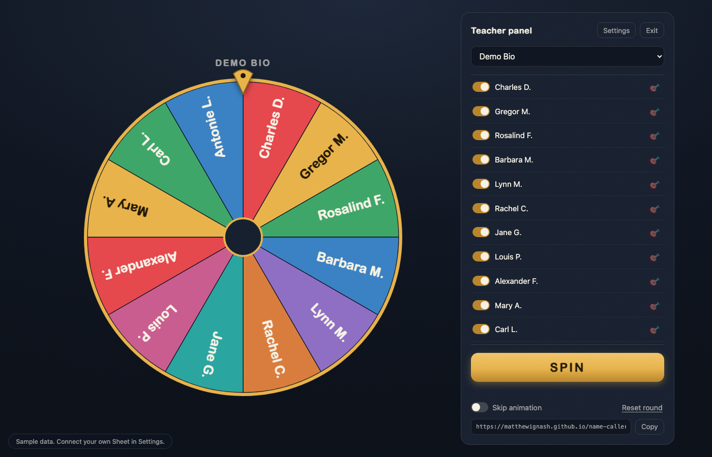
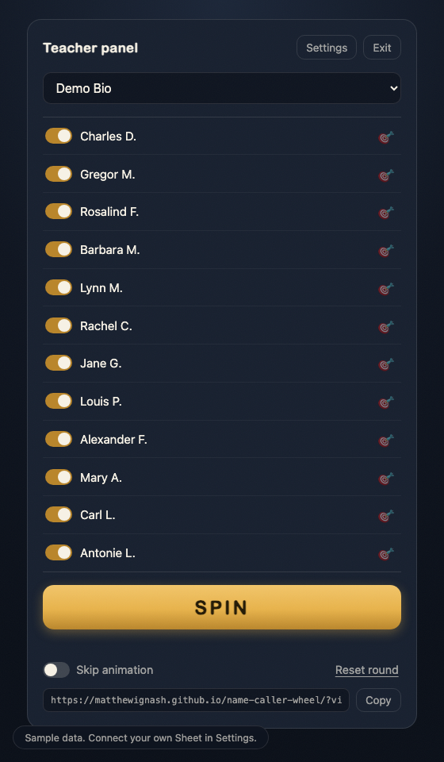
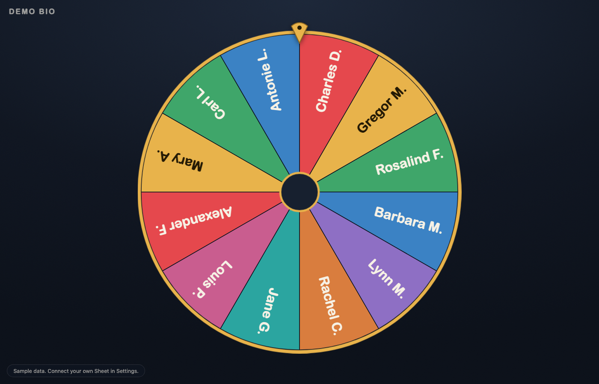

# Name Caller Wheel

A wheel-of-fortune name picker for the classroom: the wheel spins on the projector, you stay in control from your phone, and a private Google Sheet quietly keeps the record.

**[Try it right now](https://matthewignash.github.io/name-caller-wheel/)** — no account, no setup. The public site runs entirely in your browser on a sample roster.



## What it does

- **Spin a wheel of student names** with a satisfying animation, a big reveal, and confetti. Or skip the animation when the lesson needs pace.
- **Two screens, one brain.** The projector view is just the wheel — no buttons, no roster, nothing for wandering eyes. The teacher view runs on your phone or laptop and drives everything: spin, switch class, toggle students in or out, reset the round.
- **Everyone before anyone repeats.** Students who have been called drop out of the pool until you reset the round. Absent today? One toggle removes them from the wheel.
- **Call on exactly who you need.** A discreet button beside each name runs the identical spin animation, landing on that student. On the projector it is indistinguishable from a random pick — but your log records the difference.
- **A participation log that writes itself.** Every call lands in your private Sheet: who, when, which class, and whether it was a random `spin` or a deliberate `pick`, plus a Note column that is yours alone. Comment writing and conference prep, pre-gathered.

| Teacher view (your device) | Projector view (their screen) |
| --- | --- |
|  |  |

## The pattern (and why the code hides nothing)

This repo is completely public, yet it front-ends a private spreadsheet. The trick is where each piece lives:

```
GitHub Pages (public)          Google's servers (private, yours)
┌─────────────────────┐        ┌──────────────────────────────┐
│ index.html          │  POST  │ Apps Script web app (Code.gs)│
│ the whole app,      │ ─────> │ key check ──> your Sheet     │
│ zero secrets        │        │ SECRET_KEY in Script         │
└─────────────────────┘        │ Properties, never in code    │
                               └──────────────────────────────┘
```

- The frontend is a single static HTML file. It contains sample data and no secrets, so it can live on GitHub Pages for free.
- Your spreadsheet stays private. In front of it sits a tiny Google Apps Script web app — the code is right here in [`apps-script/Code.gs`](apps-script/Code.gs) — that answers only when a request carries your secret key.
- The key and the script URL are never in this repo. The key lives in the script's own Script Properties; you paste both into the app's Settings once per device, where they stay in that browser's local storage.
- Anyone else who opens the site gets **demo mode**: the full app on an obviously fake roster, zero network calls. Wrong key, dead network, no configuration — every failure lands softly in demo mode with a badge, never an error page mid-lesson.

Two design choices do the heavy lifting:

1. **The winner is chosen before the wheel moves.** The teacher device picks the outcome, then broadcasts a command — `land on this name, spin exactly this way`. Every screen renders the identical animation, and "skip animation" is just the same result without the wait.
2. **The projector is a pure renderer.** It executes commands and decides nothing. Same browser? Commands arrive instantly over a BroadcastChannel. Teacher on your phone? They travel through the Sheet, which the projector checks every couple of seconds.

## Set up your own (about 15 minutes)

You need a Google account and a comfort level of "I use Google Sheets." No coding, no command line.

### 1. Make the spreadsheet (3 min)

Create a new Google Sheet. Rename its first tab to `Roster` and give it these exact headers, then add your students:

| Class  | Student  | Active |
| ------ | -------- | ------ |
| Bio 9A | Aanya K. | TRUE   |
| Bio 9A | Ben O.   | TRUE   |
| Chem 11| Diego A. | TRUE   |

Tips: one row per student; the Class column becomes your class picker; use first name + last initial so the projector never shows full names. Select the Active column and use Insert → Checkbox if you like. The other tabs (Log, State, Settings) create themselves — details in [`apps-script/sheet-template.md`](apps-script/sheet-template.md).

### 2. Add the backend script (3 min)

1. In your sheet: **Extensions → Apps Script**. A code editor opens.
2. Delete the placeholder code and paste in the entire contents of [`apps-script/Code.gs`](apps-script/Code.gs).
3. Save (the disk icon or Cmd/Ctrl-S).

### 3. Set your secret key (2 min)

1. In the Apps Script editor, click the gear icon (**Project Settings**).
2. Under **Script Properties**, click **Add script property**.
3. Property: `SECRET_KEY` — Value: a passphrase you invent. Make it long and unguessable; treat it like a password.

### 4. Deploy (4 min)

1. Click **Deploy → New deployment**.
2. Gear icon next to "Select type" → **Web app**.
3. Set **Execute as: Me** and **Who has access: Anyone**. This is safe: "anyone" can only reach the key check. Without your key, the script answers `unauthorized` and nothing more.
4. Click **Deploy**. Google will ask you to authorize the script, including an "unverified app" warning screen — it is your own script reading your own sheet; click Advanced and proceed.
5. Copy the **Web app URL** (it ends in `/exec`).

### 5. Connect the app (2 min)

1. Open the [teacher view](https://matthewignash.github.io/name-caller-wheel/?view=teacher) → **Settings**.
2. Paste the web app URL and your secret key under **Your Google Sheet** → **Save & reconnect**.
3. Your classes appear. Spin something.

The URL and key are saved per browser, so repeat step 5 once on each device you use — typically your phone and the classroom computer.

### 6. Classroom setup

- On the classroom computer, open the **projector link** (copy it from the bottom of the teacher panel) and bookmark it. Full-screen it with F11.
- Running both from one machine? Click **Open** beside that link. The projector view lands in a second tab — drag it to the projector screen and F11 it — while the teacher panel stays live in the first.
- Keep the teacher view open on your phone. Spin from anywhere in the room.
- After class, open the Sheet's Log tab. Add your own notes in the Note column — the app never touches it.

## Troubleshooting

- **"Demo data — your Sheet could not be reached."** The URL or key is wrong, or the deployment changed. Re-check Settings; make sure the URL ends in `/exec` and the key matches the script property exactly.
- **Changed Code.gs and nothing happened?** Apps Script serves the deployed version, not the saved one. Deploy → Manage deployments → edit → new version.
- **Roster edits in the Sheet not showing?** The app loads rosters when a view opens. Reload the page after editing the Sheet directly.
- **Projector not reacting to your phone?** It checks the Sheet every ~2 seconds and pauses while its tab is hidden. Make sure the projector tab is actually visible, and that both devices carry the URL + key.

## What students see

The wheel, the class name, and the winner. No roster list, no controls, no way to navigate anywhere else from the projected page. The Sheet, the log, and the teacher view exist only on your side of the desk.

## Repo layout

```
index.html                  the entire app — no build, no frameworks, no dependencies
apps-script/Code.gs         the backend you paste into Apps Script
apps-script/sheet-template.md   spreadsheet layout reference
screenshots/                what it looks like
```

## License

[MIT](LICENSE). Take it, remix it, wire it to your own Sheet.
